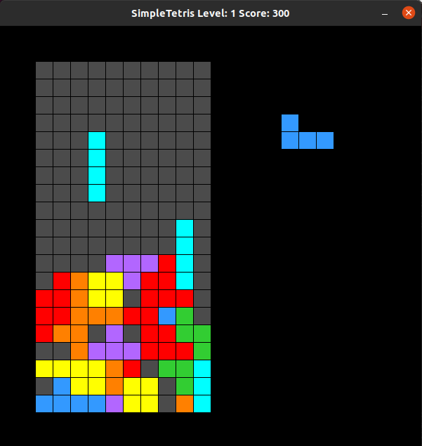

# CPPND: Capstone Project
## Project Title: Simple Tetris

This is a simple Tetris game leveraging starter repo from the Capstone project in the [Udacity C++ Nanodegree Program](https://www.udacity.com/course/c-plus-plus-nanodegree--nd213). The code is inspired by the tutorial of basic Tetris game in C++ (https://javilop.com/gamedev/tetris-tutorial-in-c-platform-independent-focused-in-game-logic-for-beginners/). 

Details of Tetris is described with wiki (https://en.wikipedia.org/wiki/Tetris). 

## Controls
The game starts automatically when the program runs. Players can use arrow keys on keyboard for moving:
* Left Arrow Button: Move tetriminos left
* Right Arrow Button: Move tetriminos right
* Up Arrow Button: Rotate tetriminos
* Space Bar Button: Rotate tetriminos
* Down Arrow Button: Place tetriminos to the bottom most possible location

Players can also control the game with below keyboard buttons:
* Z Button: Decrease game level and speed
* X Button: Increase game level and speed
* Q Button: Quit the game 
* N Button: Start a new game after game over

Game scoring follows the common Tetris game described with (https://en.wikipedia.org/wiki/Tetris#Scoring). For every 1000 scores increment, game level and speed will automatically increase, to the maximum game level 5, which is fastest game speed. At anytime during the game play, players can increase or decrease game level with X and Z keyboard buttons.

## Dependencies for Running Locally
* cmake >= 3.7
  * All OSes: [click here for installation instructions](https://cmake.org/install/)
* make >= 4.1 (Linux, Mac), 3.81 (Windows)
  * Linux: make is installed by default on most Linux distros
  * Mac: [install Xcode command line tools to get make](https://developer.apple.com/xcode/features/)
  * Windows: [Click here for installation instructions](http://gnuwin32.sourceforge.net/packages/make.htm)
* SDL2 >= 2.0
  * All installation instructions can be found [here](https://wiki.libsdl.org/Installation)
  * Note that for Linux, an `apt` or `apt-get` installation is preferred to building from source.
* gcc/g++ >= 5.4
  * Linux: gcc / g++ is installed by default on most Linux distros
  * Mac: same deal as make - [install Xcode command line tools](https://developer.apple.com/xcode/features/)
  * Windows: recommend using [MinGW](http://www.mingw.org/)

## Basic Build Instructions

1. Clone this repo.
2. Make a build directory in the top level directory: `mkdir build && cd build`
3. Compile: `cmake .. && make`
4. Run it: `./SimpleTetris`.

## Class Structure
This project includes 4 classes:
* Tetrimino: Tetrimino class stores implemenation details of each terimino and as a data store of current falling tetrimino and next generated tetrimino for Game class.
* Game: Game is the major class includes all implemenaton of game play, input controls, as well as level and scoring logics. It leverage Tetrimino, Board and Renderer classes. Game main loop is implemented in this class and called by main function with Input, Update, Render pattern as a blocking call.
* Board: Data class for storing data for each location on the game board, including color information, and if that is used by other tetrimino already.
* Renderer: This class levergae SDL library to perform different operations in the game play screen. Including clearing the screen, drawing tetriminos, update windows title for user information etc.

## Rubric Points Addressed
* The project demostrates an understanding of C++ functions and control structures.
main.cpp, game.cpp line 171 onwards

* The project accepts user input and process the input.
game.cpp line 305 onwards

* The project uses Object Oriented Programming techniques.
game.h, renderer.h, tetrimino.h

* Classes use appropriate access specifiers for class members.
game.h, renderer.h, tetrimino.h

* Class constructors utilize member initialization lists.
game.h line 4, renderer.cpp line 5, tetrimino.cpp line 263

* Classes abstract implementation details from their interfaces.
tetrimino.h, renderer.h line 61 onwards, game.h line 22

* Classes encapsulate behavior.
game.h, renderer.h, tetrimino.h

* Overloaded functions allow the same function to operate on different parameters.
renderer.h line 92-93, tetrimino.h line 14-18

* The project makes use of references in function declarations.
game.h line 22 onwards
